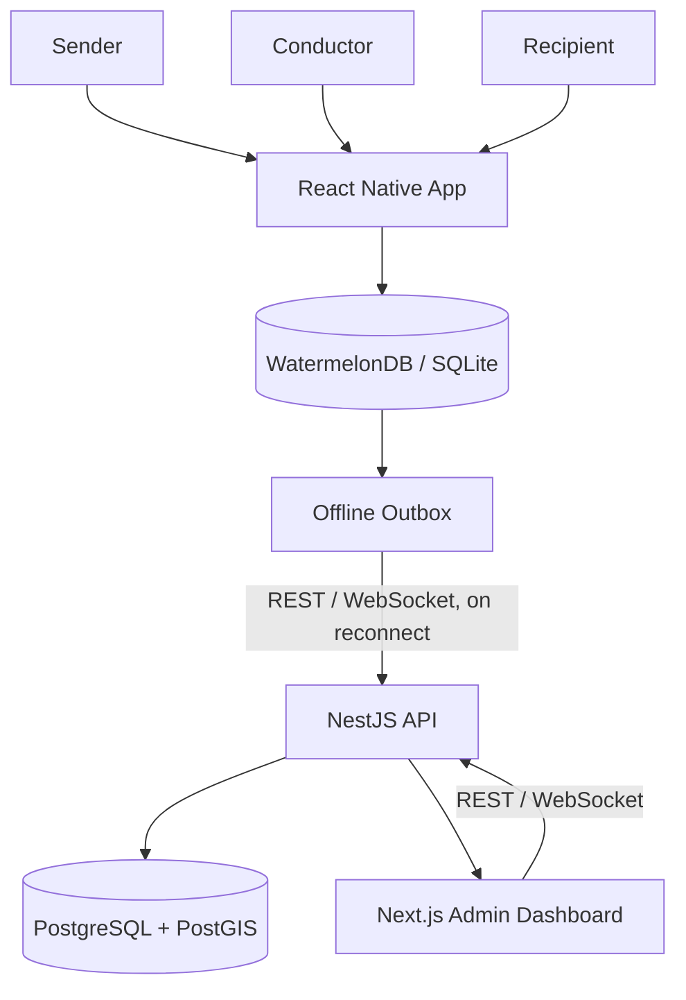
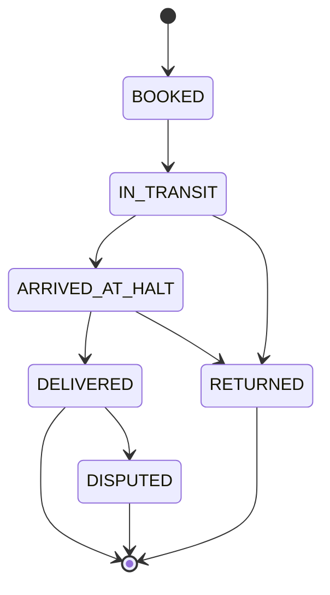

# Vahak (वाहक)

**Parcel delivery, riding on the buses that already run.**

[]()
[]()
[]()
[]()

---

## Overview

Vahak turns existing public bus routes and halts into a structured parcel logistics network. It does not add vehicles to the road — it adds a coordination layer on top of transport that already exists.

Senders book a parcel, conductors carry it as part of their normal route, and recipients confirm delivery — all designed to work even when the phone in hand has no signal.

## Problem Statement

**PS014 — Smart Parcel Delivery via Public Buses**
Theme: Transportation · Category: Software

Rural and semi-urban parcel movement is slow, expensive, or simply unavailable outside major courier networks. Public buses already travel these routes daily, with spare capacity going unused.

## Why Vahak

| Constraint | Vahak's Answer |
|---|---|
| No new fleet budget | Uses existing bus routes and halts |
| Intermittent rural connectivity | Offline-first mobile app, sync-on-reconnect |
| Trust in an unattended handover | Signed, single-use QR/PIN verification |
| Conductor incentive to participate | Transparent, ledgered incentive per parcel |
| Operational accountability | Full consignment event timeline on the admin dashboard |

## Core Workflow

```
Sender books parcel
      ↓
Fare calculated
      ↓
QR waybill generated
      ↓
Conductor scans parcel
      ↓
Parcel → IN_TRANSIT
      ↓
Conductor generates signed handover QR/PIN
      ↓
Recipient verifies delivery (offline-capable)
      ↓
Device reconnects → offline events sync
      ↓
Admin dashboard reflects parcel timeline + conductor incentive
```

## Key Differentiator

**Offline-verifiable, signed delivery confirmation.**

Delivery handover is confirmed through a cryptographically signed QR/PIN with a nonce and expiry — validated on-device, without requiring live connectivity at the point of handover. This is the feature the rest of the system is built around.

## Architecture



The mobile client is offline-first by design: every write lands locally before it is ever queued for sync. The API is the single source of truth once connectivity is restored.

## Technology Stack

| Layer | Technology |
|---|---|
| Mobile app | React Native, TypeScript |
| Local persistence | WatermelonDB / SQLite |
| Sync | Offline outbox pattern, REST + WebSocket |
| Backend | NestJS (modular monolith) |
| Database | PostgreSQL + PostGIS |
| Admin dashboard | Next.js |
| Auth | JWT, role-based access control |
| Delivery proof | Signed QR / PIN, nonce-based, single-use |

## Application Roles

Vahak ships as **one React Native application** with role-based routing — not three separate apps.

| Role | Responsibilities |
|---|---|
| Sender | Book parcel, pay fare, track status, view waybill |
| Conductor | Scan pickup, mark transit, generate handover QR/PIN, view incentives |
| Recipient | Verify handover, confirm delivery, raise dispute if needed |
| Admin | Monitor routes, consignments, conductor incentives, disputes |

Role is resolved at login and drives navigation, screens, and permissions within the single codebase.

## Offline-First Architecture

**While offline:**
- All actions persist to local SQLite immediately
- UI state updates optimistically
- Every state change is recorded as a durable outbox event
- Delivery verification can complete fully offline

**On reconnect:**
- Outbox events are batch-synced to the API
- Sync is idempotent — replays and duplicates are safely discarded
- Server reconciles event order and resolves conflicts
- Admin dashboard updates with the reconciled timeline

## Delivery Verification

Handover confirmation uses a signed token, not a trust-based tap:

- **Signed QR** — issued by the conductor's device, signed with a device/session key
- **Nonce** — unique per handover, prevents replay
- **Expiration** — token is time-bound
- **Single-use** — consumed on first successful verification
- **PIN fallback** — for recipients without a camera-capable device
- **Offline verification** — signature and nonce checked entirely on-device; sync happens later

No acoustic handshake, biometric layer, or blockchain anchoring is part of this MVP.

## Transport Data

The prototype is built against available public transport route and halt data (including MSRTC/ST and PMPML datasets where obtainable). This is **prototype/reference data**, not a production feed.

> No official partnership, live API access, or production integration with MSRTC or PMPML exists at this stage.

## Data Model

| Entity | Purpose |
|---|---|
| `User` | Sender, conductor, recipient, or admin account |
| `Bus` | Physical vehicle mapped to a route |
| `Route` | Ordered sequence of halts a bus services |
| `Halt` | Fixed pickup/drop point along a route |
| `Consignment` | A single parcel booking and its lifecycle |
| `ConsignmentEvent` | Immutable timeline entry for a consignment (scan, transit, handover, delivery, dispute) |
| `IncentiveLedger` | Per-conductor earnings tied to completed consignments |
| `Dispute` | Recipient- or sender-raised issue against a consignment |

### Consignment State Machine



## API Overview

Represents the planned API surface for the MVP. Not every endpoint is fully implemented at hackathon stage.

| Method | Endpoint | Purpose |
|---|---|---|
| POST | `/api/v1/auth/login` | Authenticate, issue JWT |
| GET | `/api/v1/routes` | List available bus routes and halts |
| POST | `/api/v1/consignments` | Create a new parcel booking |
| GET | `/api/v1/consignments/:id` | Fetch consignment details and timeline |
| POST | `/api/v1/consignments/:id/scan` | Conductor pickup scan |
| POST | `/api/v1/consignments/:id/handover` | Generate signed handover QR/PIN |
| POST | `/api/v1/consignments/:id/verify-delivery` | Recipient delivery verification |
| POST | `/api/v1/consignments/:id/dispute` | Raise a delivery dispute |
| GET | `/api/v1/incentives/:conductorId` | Conductor incentive ledger |
| POST | `/api/v1/sync/batch` | Idempotent offline event batch sync |
| GET | `/api/v1/dashboard/summary` | Admin dashboard aggregate view |

## Repository Structure

```
vahak/
├── apps/
│   ├── mobile/          # React Native app (sender/conductor/recipient)
│   └── dashboard/        # Next.js admin dashboard
├── services/
│   └── api/               # NestJS modular monolith
├── packages/
│   └── shared/            # Shared types, constants, validation
├── database/               # Schema, migrations, seed data
├── docs/                    # Architecture and design docs
├── .gitignore
├── package.json
└── README.md
```

## Hackathon MVP Scope

**In scope (Core MVP):**
- Single React Native app with role-based routing
- Offline-first booking, scan, and delivery lifecycle
- Signed QR/PIN handover with nonce, expiry, single-use, PIN fallback
- Offline outbox with idempotent batch sync
- NestJS API + PostgreSQL/PostGIS backend
- Next.js admin dashboard showing consignment timeline and incentives

**Optional (if time permits):**
- Marathi voice booking via device-native speech recognition
- Camera-assisted parcel size suggestion
- BLE proximity signal at handover
- Basic dispute/photo workflow

**Explicitly out of scope for this MVP:**
- Acoustic cryptographic handshake
- Self-hosted Whisper/Vosk Marathi ASR
- 3D volumetric parcel measurement
- ML-based bus capacity or route-deviation prediction
- Blockchain, Kubernetes, full microservices
- Real payment/escrow infrastructure
- Official MSRTC/PMPML API integration

## Development Roadmap

| Phase | Deliverable |
|---|---|
| 1 | Auth, route/halt data model, consignment booking |
| 2 | Conductor scan flow, IN_TRANSIT state, offline outbox |
| 3 | Signed handover QR/PIN, offline delivery verification |
| 4 | Sync engine, idempotency, server reconciliation |
| 5 | Admin dashboard — timeline view, incentive ledger |
| 6 | Dispute workflow, polish, demo hardening |

## Security Principles

- **JWT-based auth** with role-based access control for every API route
- **Signed handover tokens** — nonce + expiry + single-use, verifiable offline
- **Idempotent sync** — batch sync endpoint rejects duplicate/replayed events by event ID
- **Least-privilege roles** — sender, conductor, recipient, and admin each see only what their role requires
- **Local data at rest** — SQLite store scoped to the authenticated user's session

## Reliability / Failure Strategy

| Failure Mode | Mitigation |
|---|---|
| No connectivity at handover | Fully offline signed QR/PIN verification |
| Duplicate sync on reconnect | Idempotency key per outbox event |
| Conductor device loss mid-route | Consignment state recoverable from last synced event |
| Conflicting offline/online state | Server-side reconciliation on sync, event-timestamp ordered |
| Disputed delivery | Dispute workflow captures conflicting claims for admin review |

## Business Model

| Stakeholder | Value |
|---|---|
| Sender | Lower-cost parcel movement using existing transit |
| Conductor | Transparent, per-parcel incentive on top of regular duty |
| Transport operator | Potential additional utilization/revenue on existing runs |
| Recipient | Predictable, trackable delivery window |
| Platform | Transaction or subscription-based service revenue |

*No financial figures below are validated data — they are stated as pilot assumptions where used.*

## Impact

- Better utilization of existing public transport capacity, without new fleet investment
- Improved logistics access for rural and semi-urban areas
- End-to-end parcel traceability via the consignment event timeline
- Additional, transparent earning opportunity for conductors
- Wider market access for farmers and small businesses (MSMEs) dependent on local transit corridors

## Future Roadmap

- Formal MSRTC/PMPML data or API partnership
- Real payment and escrow integration
- ML-assisted route deviation and capacity prediction
- Expanded multilingual voice interfaces
- Microservice decomposition at scale

## Hackathon Information

| Field | Value |
|---|---|
| Hackathon | Smart Kopargaon Hackathon 2026 |
| Problem Statement | PS014 — Smart Parcel Delivery via Public Buses |
| Theme | Transportation |
| Category | Software |
| Team | FaultLine |

## Team

**FaultLine** — Smart Kopargaon Hackathon 2026

## Disclaimer

Vahak is a hackathon prototype and proposed system, not a production deployment. Real-world rollout would require transport authority approval, formal operational agreements, regulatory review, a security/privacy audit, and field validation with actual bus operators and users. No claims in this document should be read as evidence of existing partnerships, production readiness, or validated performance metrics.

## License

MIT
